# Wallpapers

Free 4K desktop wallpapers (3840×2160) for **KDE Plasma**, **Linux**, and general
desktop use — built by [Agundur](https://www.agundur.de). Each wallpaper is a
ready-to-use PNG at full 4K resolution, no upscaling.

## Preview

| | | | |
|---|---|---|---|
| 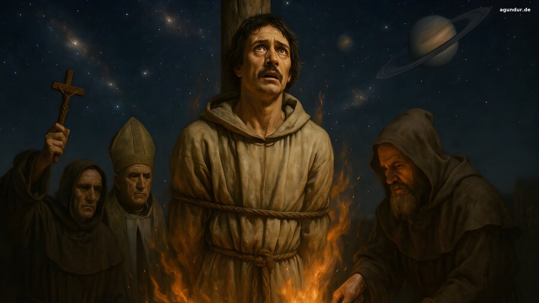 | 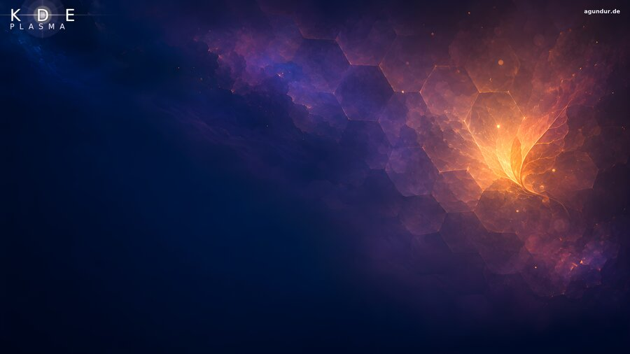 | 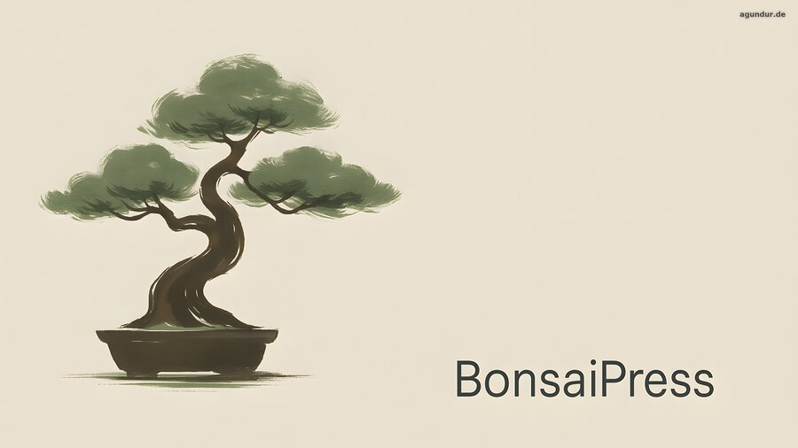 | 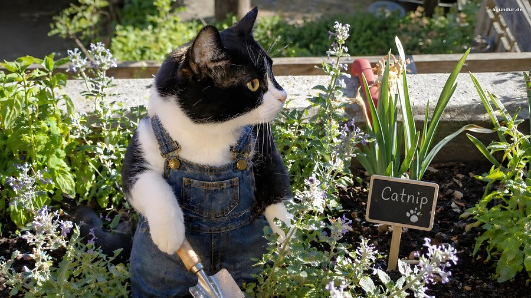 |
| [`giordano-bruno-4k.png`](giordano-bruno-4k.png) | [`honeycomb-nebula-kde-plasma-4k.png`](honeycomb-nebula-kde-plasma-4k.png) | [`bonsai-tree-4k.png`](bonsai-tree-4k.png) | [`cat-gardener-4k.png`](cat-gardener-4k.png) |

| | | | |
|---|---|---|---|
| 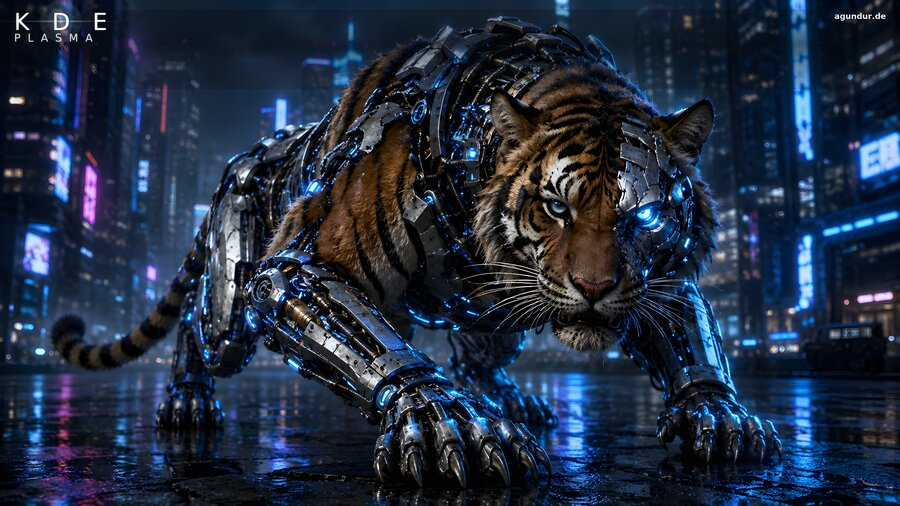 | 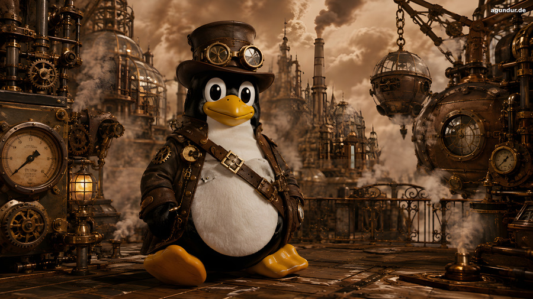 | 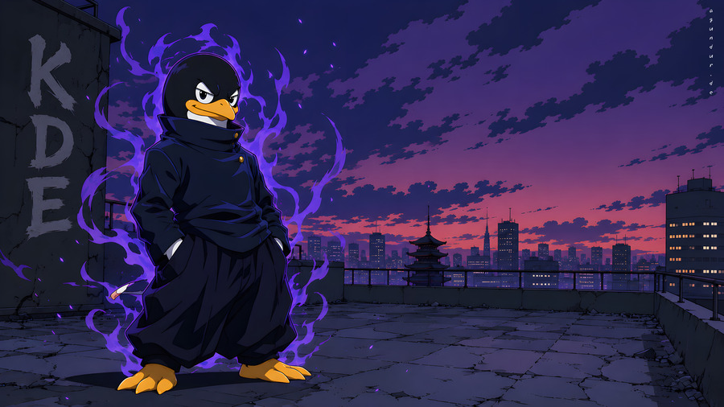 | 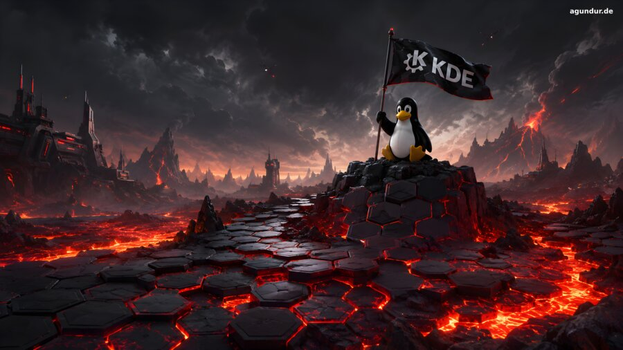 |
| [`cyborg-tiger-kde-plasma-4k.png`](cyborg-tiger-kde-plasma-4k.png) | [`steampunk-tux-4k.png`](steampunk-tux-4k.png) | [`anime-tux-4k.png`](anime-tux-4k.png) | [`lava-tux-kde-plasma-4k.png`](lava-tux-kde-plasma-4k.png) |

| | | | |
|---|---|---|---|
| 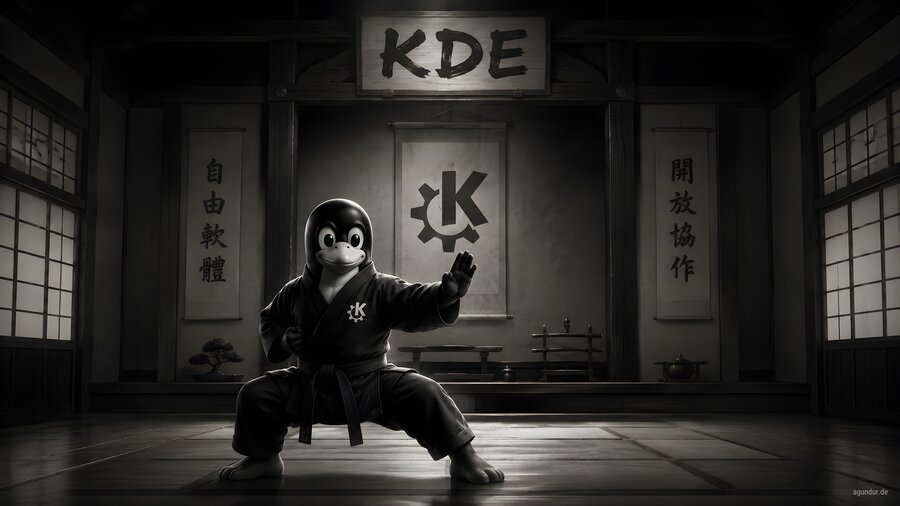 | 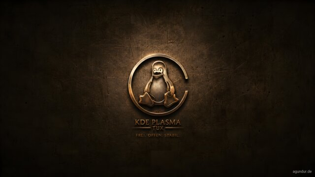 | 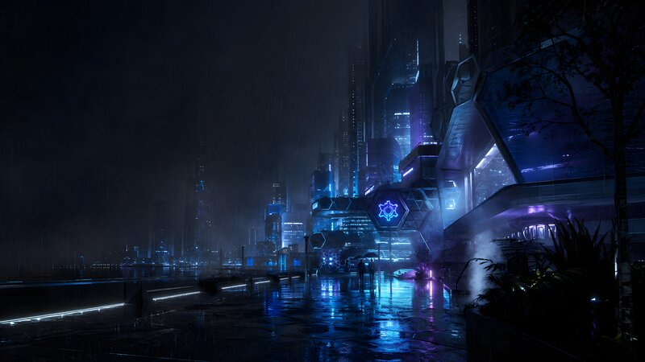 | 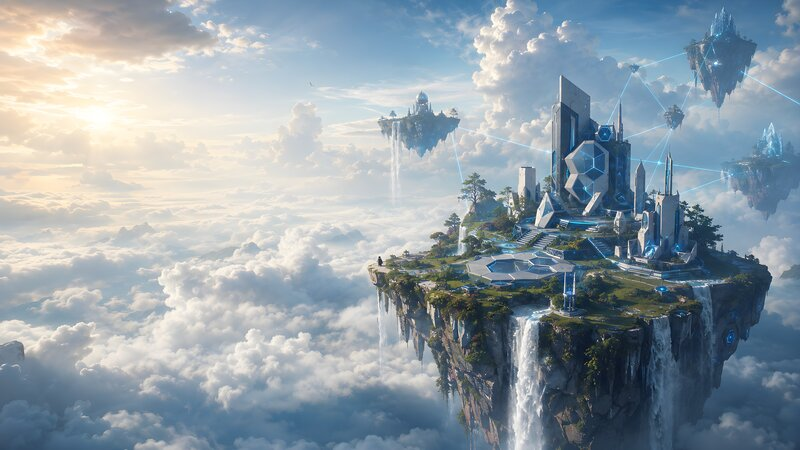 |
| [`kde-dojo-4k.png`](kde-dojo-4k.png) | [`mortal-tux-kde-plasma-4k.png`](mortal-tux-kde-plasma-4k.png) | [`kde-neon-rain-4k.png`](kde-neon-rain-4k.png) | [`floating-islands-4k.png`](floating-islands-4k.png) |

| | | | |
|---|---|---|---|
|  |  | 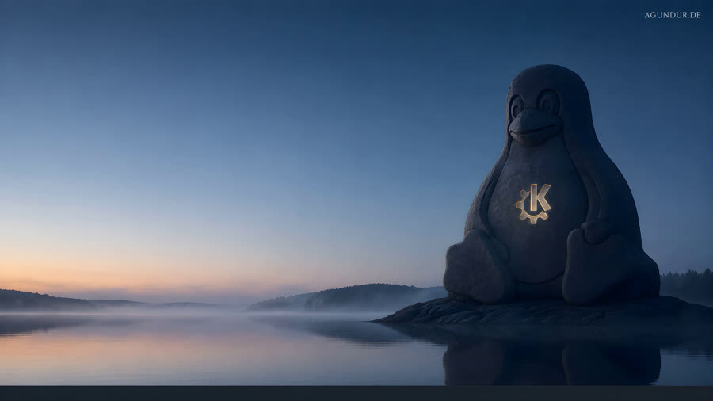 | 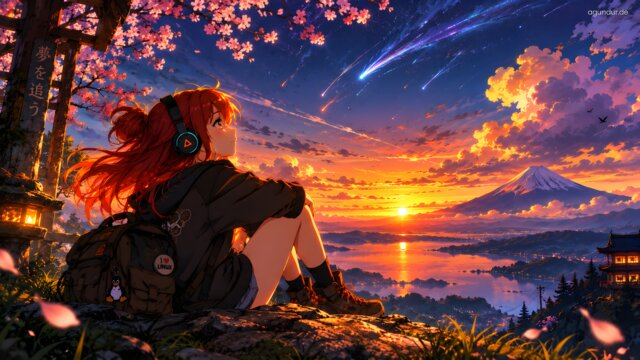 |
| [`tux-mug-4k.png`](tux-mug-4k.png) | [`windows-is-broken-4k.png`](windows-is-broken-4k.png) | [`excalitux-4k.png`](excalitux-4k.png) | [`sunset-dreamer-4k.png`](sunset-dreamer-4k.png) |

## Wallpapers

### Cyborg Tiger — KDE Plasma

A cybernetic tiger prowling a neon cyberpunk city at night, with a "KDE Plasma"
title treatment. Originally published on the [KDE Store](https://store.kde.org/)
by Agundur.

- File: `cyborg-tiger-kde-plasma-4k.png`
- Resolution: 3840×2160
- License: [CC BY-SA](https://creativecommons.org/licenses/by-sa/4.0/) (as published on the KDE Store)

### Honeycomb Nebula — KDE Plasma

A hexagon-patterned cosmic nebula in purple and amber, with a "KDE Plasma"
title treatment — companion artwork for the [KHoneycomb](https://github.com/Agundur-KDE/KHoneycomb)
KDE Plasma widget.

- File: `honeycomb-nebula-kde-plasma-4k.png`
- Resolution: 3840×2160
- License: [CC BY 4.0](https://creativecommons.org/licenses/by/4.0/)

### Bonsai Tree

A minimalist ink-style bonsai tree on a warm cream background — the
[BonsaiPress](https://www.agundur.de) brand wallpaper.

- File: `bonsai-tree-4k.png`
- Resolution: 3840×2160
- License: [CC BY 4.0](https://creativecommons.org/licenses/by/4.0/)

### Cat Gardener

A cat in tiny denim overalls, tending a "Catnip" patch in a garden bed.

- File: `cat-gardener-4k.png`
- Resolution: 3840×2160
- License: [CC BY 4.0](https://creativecommons.org/licenses/by/4.0/)

### Giordano Bruno

A dramatic depiction of Giordano Bruno at the stake in 1600, gazing at Saturn
and the stars — a nod to the cosmological ideas that led to his condemnation.

- File: `giordano-bruno-4k.png`
- Resolution: 3840×2160
- License: [CC BY 4.0](https://creativecommons.org/licenses/by/4.0/)

### Steampunk Tux

The Linux penguin mascot reimagined in full steampunk gear — top hat, goggles,
leather harness — sitting in a brass-and-copper industrial cityscape.

- File: `steampunk-tux-4k.png`
- Resolution: 3840×2160
- License: [CC BY 4.0](https://creativecommons.org/licenses/by/4.0/)

### Anime Tux

Tux reimagined as an anime sorcerer on a Tokyo rooftop at dusk, glowing purple
cursed-energy aura, city skyline in the background.

- File: `anime-tux-4k.png`
- Resolution: 3840×2160
- License: [CC BY 4.0](https://creativecommons.org/licenses/by/4.0/)

### Lava Tux — KDE

Tux planting a "K KDE" flag atop a hexagon-tiled volcanic outcrop, lava
flowing between the tiles, a ruined sci-fi skyline and erupting volcanoes
in the distance.

- File: `lava-tux-kde-plasma-4k.png`
- Resolution: 3840×2160
- License: [CC BY 4.0](https://creativecommons.org/licenses/by/4.0/)

### KDE Dojo

Tux in a black karate gi, mid-stance in a traditional Japanese dojo, with a
"KDE" sign above the entrance and Chinese calligraphy scrolls reading "free
software" (自由軟體) and "open collaboration" (開放協作) on the walls.

- File: `kde-dojo-4k.png`
- Resolution: 3840×2160
- License: [CC BY 4.0](https://creativecommons.org/licenses/by/4.0/)

### Mortal Tux — KDE Plasma

A bronze memorial medallion bearing the Tux emblem, engraved "KDE Plasma Tux —
Frei. Offen. Stabil." on a weathered metal plaque.

- File: `mortal-tux-kde-plasma-4k.png`
- Resolution: 3840×2160
- License: [CC BY 4.0](https://creativecommons.org/licenses/by/4.0/)

### KDE Neon Rain

A rain-slicked cyberpunk street at night, towering neon-lit skyscrapers and a
glowing blue hexagon emblem echoing the KDE Plasma icon shape.

- File: `kde-neon-rain-4k.png`
- Resolution: 3840×2160
- License: [CC BY 4.0](https://creativecommons.org/licenses/by/4.0/)

### Floating Islands

A futuristic hex-crystalline city on an island drifting high above the
clouds, waterfalls pouring off its edges, linked by glowing lines to smaller
islands in the distance.

- File: `floating-islands-4k.png`
- Resolution: 3840×2160
- License: [CC BY 4.0](https://creativecommons.org/licenses/by/4.0/)

### Tux Mug

A cozy morning coffee moment — a photo of someone warming their hands on a
mug printed with the Tux penguin, sunlight streaming through a wooden window
frame.

- File: `tux-mug-4k.png`
- Resolution: 3840×2160
- License: [CC BY 4.0](https://creativecommons.org/licenses/by/4.0/)

### Windows is Broken

Tux bursting through a shattered glass pane — a pun on "Windows", with an
`agundur.de` watermark in Cantarell (closest free match to Segoe UI) top
right, mimicking a Windows desktop watermark.

- File: `windows-is-broken-4k.png`
- Resolution: 3840×2160
- License: [CC BY 4.0](https://creativecommons.org/licenses/by/4.0/)

### Excalitux

A monumental Tux carved as a dark-stone monolith beside a calm mist-covered
lake at blue hour, a glowing KDE Plasma gear emblem set into its chest — a
nod to the Lady of the Lake/Excalibur legend. `agundur.de` watermark in
Cinzel, top right.

- File: `excalitux-4k.png`
- Resolution: 3840×2160
- License: [CC BY 4.0](https://creativecommons.org/licenses/by/4.0/)

### Sunset Dreamer

A red-haired anime traveler with headphones and a Tux-charm backpack ("I ❤
LINUX" pin) sits on a cherry-blossom ridge at blue-hour sunset, watching
shooting stars streak over Mt. Fuji and a lakeside town. `agundur.de`
watermark in Poppins, top right.

- File: `sunset-dreamer-4k.png`
- Resolution: 3840×2160
- License: [CC BY 4.0](https://creativecommons.org/licenses/by/4.0/)

## Usage

Download any PNG above and set it as your desktop background — works on KDE
Plasma, GNOME, Windows, and macOS. No installation, no dependencies.

## Keywords

kde wallpaper, kde plasma wallpaper, linux wallpaper, 4k wallpaper, desktop
wallpaper, cyberpunk wallpaper, tiger wallpaper, nebula wallpaper, honeycomb
wallpaper, bonsai wallpaper, cat wallpaper, historical wallpaper, steampunk
wallpaper, tux wallpaper, linux penguin wallpaper, anime wallpaper, lava
wallpaper, volcano wallpaper, hexagon wallpaper, dojo wallpaper, karate
wallpaper, free wallpaper, open source wallpaper, medallion wallpaper,
bronze wallpaper, coin wallpaper, neon wallpaper, rain wallpaper, cyberpunk
street wallpaper, floating islands wallpaper, fantasy wallpaper, coffee
wallpaper, cozy wallpaper, mug wallpaper, broken glass wallpaper, shattered
screen wallpaper, tux vs windows wallpaper, funny linux wallpaper, monolith
wallpaper, lake wallpaper, fantasy wallpaper, arthurian wallpaper, excalibur
wallpaper, blue hour wallpaper, minimalist wallpaper, anime girl wallpaper,
cherry blossom wallpaper, sakura wallpaper, Mt Fuji wallpaper, shooting star
wallpaper, sunset wallpaper, Japan wallpaper, headphones wallpaper, travel
wallpaper

## More from Agundur

- [Agundur-KDE](https://github.com/Agundur-KDE) — open-source KDE Plasma
  widgets (KCast, KFritz, KHoneycomb, and more)
- [agundur.de](https://www.agundur.de) — BonsaiPress and other tools
